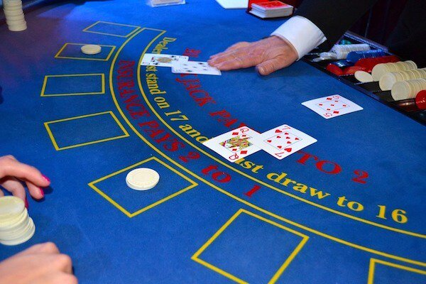

# Design Blackjack and a Deck of Cards

Let's design a game of Blackjack.
Blackjack is the most widely played casino game in the world. It falls under the category of comparing-card games and is usually played between several players and a dealer. Each player, in turn, competes against the dealer, but players do not play against each other. In Blackjack, all players and the dealer try to build a hand that totals 21 points without going over. The hand closest to 21 wins.

<p align="center">
  <br>
</p>

## System Requirements
Blackjack is played with one or more standard 52-card decks. The standard deck has 13 ranks in 4 suits.

### Background
* To start with, the players and the dealer are dealt separate hands. Each hand has two cards in it.
* The dealer has one card exposed (the up card) and one card concealed (the hole card), leaving the player with incomplete information about the state of the game.<br>
* The player’s objective is to make a hand that has more points than the dealer, but less than or equal to 21 points.<br>
* The player is responsible for placing bets when they are offered, and taking additional cards to complete their hand.<br>
* The dealer will draw additional cards according to a simple rule: when the dealer’s hand is 16 or less, they will draw cards (called a hit), when it is 17 or more, they will not draw additional cards (or stand pat).<br>

### Points calculation
Blackjack has different point values for each of the cards:

* The number cards (2-10) have the expected point values.<br>
* The face cards (Jack, Queen, and King) all have a value of 10 points.<br>
* The Ace can count as one point or eleven points. Because of this, an Ace and a 10 or face card totals 21. This two-card winner is called “blackjack”.<br>
* When the points include an ace counting as 11, the total is called soft-total; when the ace counts as 1, the total is called hard-total. For example, A+5 can be considered a soft 16 or a hard 6.<br>

### Gameplay
* The player places an initial bet.<br>
* The player and dealer are each dealt a pair of cards.<br>
* Both of the player’s cards are face up, the dealer has one card up and one card down.<br>
* If the dealer’s card is an ace, the player is offered insurance.<br>

Initially, the player has a number of choices:
* If the two cards are the same rank, the player can elect to split into two hands.<br>
* The player can double their bet and take just one more card.<br>
* The more typical scenario is for the player to take additional cards (a hit ) until either their hand totals more than 21 (they bust ), or their hand totals exactly 21, or they elect to stand.<br>

If the player’s hand is over 21, their bet is resolved immediately as a loss. If the player’s hand is 21 or less, it will be compared to the dealer’s hand for resolution.
* **Dealer has an Ace**. If the dealer’s up card is an ace, the player is offered an insurance bet. This is an additional proposition that pays 2:1 if the dealer’s hand is exactly 21. If this insurance bet wins, it will, in effect, cancel the loss of the initial bet. After offering insurance to the player, the dealer will check their hole card and resolve the insurance bets. If the hole card is a 10-point card, the dealer has blackjack, the card is revealed, and insurance bets are paid. If the hole card is not a 10-point card, the insurance bets are lost, but the card is not revealed.<br>
* **Split Hands**. When dealt two cards of the same rank, the player can split the cards to create two hands. This requires an additional bet on the new hand. The dealer will deal an additional card to each new hand, and the hands are played independently. Generally, the typical scenario described above applies to each of these hands.<br>

### Bets
* **Ante**: This is the initial bet and is mandatory to play.<br>
* **Insurance**: This bet is offered only when the dealer shows an ace. The amount must be half the ante.<br>
* **Split**: This can be thought of as a bet that is offered only when the player’s hand has two cards of equal rank. The amount of the bet must match the original ante.<br>
* **Double**: This can be thought of as a bet that is offered instead of taking an ordinary hit. The amount of the bet must match the original ante.<br>

## Use case diagram
We have two main Actors in our system:

* **Dealer**: Mainly responsible for dealing cards and game resolution.<br>
* **Player**: Places the initial bets, accepts or declines additional bets - including insurance, and splits hands. Accepts or rejects the offered resolution, including even money. Chooses among hit, double and stand pat options.<br>

### Typical Blackjack Game Use cases
Here are the top use cases of the Blackjack game:

* **Create Hands**: Initially both the player and the dealer are given two cards each. The player has both cards visible whereas only one card of the dealer’s hand is visible to the player.<br>

* **Place Bet**: To start the game, the player has to place a bet.<br>

* **Player plays the hand**: If the hand is under 21 points, the player has three options:<br>

  * Hit: The hand gets an additional card and this process repeats.<br>

  * Double Down: The player creates an additional bet, and the hand gets one more card and play is done.<br>

  * Stands Pat: If the hand is 21 points or over, or the player chooses to stand pat, the game is over.<br>

  * Resolve Bust: If a hand is over 21, it is resolved as a loser.<br>

* **Dealer plays the hand**: The dealer keeps getting a new card if the total point value of the hand is 16 or less, and stops dealing cards at the point value of 17 or more.<br>

  * Dealer Bust: If the dealer’s hand is over 21, the player’s wins the game. Player Hands with two cards totaling 21 ( “blackjack” ) are paid 3:2, all other hands are paid 1:1.<br>

* **Insurance**: If the dealer’s up card is an Ace, then the player is offered insurance:<br>
  * Offer Even Money: If the player’s hand totals to a soft 21, a blackjack; the player is offered an even money resolution. If the player accepts, the entire game is resolved at this point. The ante is paid at even money; there is no insurance bet.<br>
  * Offer Insurance: The player is offered insurance, which they can accept by creating a bet. For players with blackjack, this is the second offer after even money is declined. If the player declines, there are no further insurance considerations.<br>
  * Examine Hole Card: The dealer’s hole card is examined. If it has a 10-point value, the insurance bet is resolved as a winner, and the game is over. Otherwise, the insurance is resolved as a loser, the hole card is not revealed, and play continues.<br>

* **Split**: If the player’s hand has both cards of equal rank, the player is offered a split. The player accepts by creating an additional Bet. The original hand is removed; The two original cards are split and then the dealer deals two extra cards to create two new Hands. There will not be any further splitting.<br>

* **Game Resolution**: The Player’s Hand is compared against the Dealer’s Hand, and the hand with the higher point value wins. In the case of a tie, the bet is returned. When the player wins, a winning hand with two cards totaling 21 (“blackjack”) is paid 3:2, any other winning hand is paid 1:1.<br>

<p align="center">
  <br>
  <i>Use case diagram</i>
</p>

## Class diagram

Here are the main classes of our Blackjack game:
* **Card**: A standard playing card has a suit and point value from 1 to 11.<br>

* **BlackjackCard**: In blackjack, cards have different face values. For example, jack, queen, and king, all have a face value of 10. An ace can be counted as either 1 or 11.<br>

* **Deck**: A standard playing card deck has 52 cards and 4 suits.<br>

* **Shoe**: Contains a set of decks. In casinos, a dealer’s shoe is a gaming device to hold multiple decks of playing cards.<br>

* **Hand**: A collection of cards with one or two point values: a hard value (when an ace counts as 1) and a soft value (when an ace counts as 11).<br>

* **Player**: Places the initial bets, updates the stake with amounts won and lost. Accepts or declines offered additional bets - including insurance, and split hands. Accepts or declines offered resolution, including even money. Chooses between hit, double and stand options.<br>

* **Game**: This class encapsulates the basic sequence of play. It runs the game, offers bets to players, deals the cards from the shoe to hands, updates the state of the game, collects losing bets, pays winning bets, splits hands, and responds to player choices of a hit, double or stand.<br>

<p align="center">
  <br>
  <i>Class diagram</i>
</p>
<p align="center">
  <br>
</p>

## Activity diagrams
* **Blackjack hit or stand**: Here are the set of steps to play blackjack with hit or stand:<br>
<p align="center">
  <br>
</p>

## Code
* **Enums**: Here are the required enums:<br>
```
public enum SUIT {
  HEART,
  SPADE,
  CLUB,
  DIAMOND
}
```
* **Card**: The following class encapsulates a playing card:<br>
```
public class Card {
  private SUIT suit;
  private int faceValue;

 public SUIT getSuit() {
    return suit;
  }

  public int getFaceValue() {
    return faceValue;
  }

  Card(SUIT suit, int faceValue) {
    this.suit = suit;
    this.faceVale = faceValue;
  }
}
```
* **BlackjackCard**: BlackjackCard extends from Card class to represent a blackjack card:<br>
```
public class BlackjackCard extends Card {
  private int gameValue;

  public int getGameValue() {
    return gameValue;
  }

  public BlackjackCard(SUIT suit, int faceValue) {
    super(suit, faceValue);
    this.gameValue = faceValue;
    if(this.gameValue > 10) {
      this.gameValue = 10;
    }
  }
}
```
* **Deck and Shoe**: Shoe contains cards from multiple decks:<br>
```
public class Deck {
  private List<BlackjackCard> cards;
  private Date creationDate;

  public Deck() {
    this.creationDate = new Date();
    this.cards = new ArrayList<BlackjackCard>();
    for(int value = 1 ; value <= 13 ; value++){
      for(SUIT suit : SUIT.values()){
        this.cards.add(new BlackjackCard(suit, value));
      }
    }
  }

  public List<BlackjackCard> getCards() {
    return cards;
}

public class Shoe {
  private List<BlackjackCard> cards;
  private int numberOfDecks;

  private void createShoe() {
    this.cards = new ArrayList<BlackjackCard>();
    for(int decks = 0 ; decks < numberOfDecks ; decks++){
      cards.add(new Deck().getCards());
    }
  }

  public Shoe(int numberOfDecks) {
    this.numberOfDecks = numberOfDecks;
    createShoe();
    shuffle();
  }

  public void shuffle() {
    int cardCount = cards.size();
    Random r = new Random();
    for (int i = 0; i < cardCount ; i++){
      int index = r.nextInt(cardCount-i-1);
      swap(i, index);
    }
  }

  public void swap(int i, int j) {
    BlackjackCard temp = cards[i];
    cards[i] = cards[j];
    cards[j] = temp;
  }

  //Get the next card from the shoe
  public BlackjackCard dealCard() {
    if(cards.size() == 0 ){
      createShoe();
    }
    return cards.remove(0);
  }
}
```
* **Hand**: Hand class encapsulates a blackjack hand which can contain multiple cards:<br>
```
public class Hand {
  private ArrayList<BlackjackCard> cards;

  private List<Integer> getScores() {
    List<Integer> totals = new ArrayList();
    total.add(0);

    for (BlackjackCard card : cards) {
      List<Integer> newTotals = new ArrayList();
      for (int score : totals) {
        newTotals.add(card.faceValue() + score);
        if (card.faceValue() == 1) {
          newTotals.add(11 + score);
        }
      }
      totals = newTotals;
    }
    return totals;
  }

  public Hand(BlackjackCard c1, BlackjackCard c2) {
    this.cards = new ArrayList<BlackjackCard>();
    this.cards.add(c1);
    this.cards.add(c2);
  }

  public void addCard(BlackjackCard card) {
    cards.add(card);
  }

  // get highest score which is less than or equal to 21
  public int resolveScore() {
    List<Integer> scores = getScores();
    int bestScore = 0;
    for (int score : scores) {
      if (score <= 21 && score > bestScore) {
        bestScore = score;
      }
    }
    return bestScore;
  }
}
```
* **Player**: Player class extends from BasePlayer:<br>
```
public abstract class BasePlayer {
  private String id;
  private String passwords;
  private double balance;
  private AccountStatus status;
  private Person person;
  private List<Hand> hands;

  public boolean resetPassword();

  public List<Hand> getHands() {
    return hands;
  }

  public void addHand(Hand hand) {
    return hands.add(hand);
  }

  public void removeHand(Hand hand) {
    return hands.remove(hand);
  }
}

public class Player extends BasePlayer {
  private int bet;
  private int totalCash;

  public Player(Hand hand) {
    this.hands = new ArrayList<Hand>();
    this.hands.add(hand);
  }
}
```
* **Game**: This class encapsulates a blackjack game:<br>
```
public class Game {
  private Player player;
  private Dealer dealer;
  private Shoe shoe;
  private final int MAX_NUM_OF_DECKS = 3;

  private void playAction(string action, Hand hand) {
    switch(action) {
      case "hit": hit(hand); break;
      case "split": split(hand); break;
      case "stand pat": break; //do nothing
      case "stand": stand(); break;
      default: print("Wrong input");
    }
  }

  private void hit(Hand hand) {
    hand.addCard(shoe.dealCard());
  }

  private void stand() {
    int dealerScore = dealer.getTotalScore();
    List<Hand> hands = player.getHands();
    for(Hand hand : hands) {
      int bestScore = hand.resolveScore();
      if(playerScore == 21){
        //blackjack, pay 3:2 of the bet
      } else if (playerScore > dealerScore) {
        // pay player equal to the bet
      } else if (playerScore < dealerScore) {
        // collect the bet from the player
      } else { //tie
        // bet goes back to player
      }
    }
  }

  private void split(Hand hand) {
    Cards cards = hand.getCards();
    player.addHand(new Hand(cards[0], shoe.dealCard()));
    player.addHand(new Hand(cards[1], shoe.dealCard()));
    player.removeHand(hand);
  }


 public Game(Player player, Dealer dealer) {
    this.player = player;
    this.dealer = dealeer;
    Shoe shoe= new Shoe(MAX_NUM_OF_DECKS);
  }

  public void start() {
    player.placeBet(getBetFromUI());

    Hand playerHand = new Hand(shoe.dealCard(), shoe.dealCard());
    player.addToHand(playerHand);

    Hand dealerHand = new Hand(shoe.dealCard(), shoe.dealCard());
    dealer.addToHand(dealerHand);

    while(true){
      List<Hand> hands = player.getHands();
      for(Hand hand : hands) {
        string action = getUserAction(hand);
        playAction(action, hand);
        if(action.equals("stand")) {
          break;
        }
      }
    }
  }

  public static void main(String args[]) {
    Player player = new Player();
    Dealer dealer = new Dealer();
    Game game = new Game(player, dealer);
    game.start();
  }
}
```
