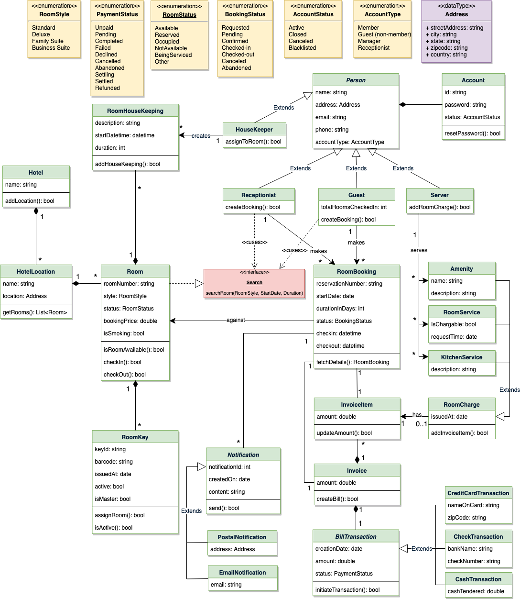

# Design a Hotel Management System
Let's design a hotel management system.

A Hotel Management System is a software built to handle all online hotel activities easily and safely. This System will give the hotel management power and flexibility to manage the entire system from a single online portal. The system allows the manager to keep track of all the available rooms in the system as well as to book rooms and generate bills.

<p align="center">
  <br>
</p>

## System Requirements
We’ll focus on the following set of requirements while designing the Hotel Management System:

1. The system should support the booking of different room types like standard, deluxe, family suite, etc.<br>

2. Guests should be able to search the room inventory and book any available room.<br>

3. The system should be able to retrieve information, such as who booked a particular room, or what rooms were booked by a specific customer.<br>

4. The system should allow customers to cancel their booking - and provide them with a full refund if the cancelation occurs before 24 hours of the check-in date.<br>

5. The system should be able to send notifications whenever the booking is nearing the check-in or check-out date.<br>

6. The system should maintain a room housekeeping log to keep track of all housekeeping tasks.<br>

7. Any customer should be able to add room services and food items.<br>

8. Customers can ask for different amenities.<br>

9. The customers should be able to pay their bills through credit card, check or cash.<br>

## Use case diagram
Here are the main Actors in our system:

* **Guest**: All guests can search the available rooms, as well as make a booking.<br>
* **Receptionist**: Mainly responsible for adding and modifying rooms, creating room bookings, check-in, and check-out customers.<br>
* **System**: Mainly responsible for sending notifications for room booking, cancellation, etc.<br>
* **Manager**: Mainly responsible for adding new workers.<br>
* **Housekeeper**: To add/modify housekeeping record of rooms.<br>
* **Server**: To add/modify room service record of rooms.<br>

Here are the top use cases of the Hotel Management System:

* **Add/Remove/Edit room**: To add, remove, or modify a room in the system.<br>
* **Search room**: To search for rooms by type and availability.<br>
* **Register or cancel an account**: To add a new member or cancel the membership of an existing member.<br>
* **Book room**: To book a room.<br>
* **Check-in**: To let the guest check-in for their booking.<br>
* **Check-out**: To track the end of the booking and the return of the room keys.<br>
* **Add room charge**: To add a room service charge to the customer’s bill.<br>
* **Update housekeeping log**: To add or update the housekeeping entry of a room.<br>

<p align="center">
  <br>
  <i>Use case diagram</i>
</p>

## Class diagram
Here are the main classes of our Hotel Management System:

* **Hotel and HotelLocation**: Our system will support multiple locations of a hotel.<br>

* **Room**: The basic building block of the system. Every room will be uniquely identified by the room number. Each Room will have attributes like Room Style, Booking Price, etc.<br>

* **Account**: We will have different types of accounts in the system: one will be a guest to search and book rooms, another will be a receptionist. Housekeeping will keep track of the housekeeping records of a room, and a Server will handle room service.<br>

* **RoomBooking**: This class will be responsible for managing bookings for a room.<br>

* **Notification**: Will take care of sending notifications to guests.<br>

* **RoomHouseKeeping**: To keep track of all housekeeping records for rooms.<br>

* **RoomCharge**: Encapsulates the details about different types of room services that guests have requested.<br>

* **Invoice**: Contains different invoice-items for every charge against the room.<br>

* **RoomKey**: Each room can be assigned an electronic key card. Keys will have a barcode and will be uniquely identified by a key-ID.<br>

<p align="center">
  <br>
  <i>Class diagram</i>
</p>
<p align="center">
  <br>
</p>

## Activity diagrams
* **Make a room booking**: Any guest or receptionist can perform this activity. Here are the set of steps to book a room:<br>
<p align="center">
  <br>
</p>
* **Check in**: Guest will check in for their booking. The Receptionist can also perform this activity. Here are the steps:<br>
<p align="center">
  <br>
</p>
* **Cancel a booking**: Guest can cancel their booking. Receptionist can perform this activity. Here are the different steps of this activity:<br>
<p align="center">
  <br>
</p>

## Code
Here is the high-level definition for the classes described above.
* **Enums, data types, and constants**: Here are the required enums, data types, and constants:<br>
```
public enum RoomStyle {
  STANDARD, DELUXE, FAMILY_SUITE, BUSINESS_SUITE
}

public enum RoomStatus {
  AVAILABLE, RESERVED, OCCUPIED, NOT_AVAILABLE, BEING_SERVICED, OTHER
}

public enum BookingStatus {
  REQUESTED, PENDING, CONFIRMED, CHECKED_IN, CHECKED_OUT, CANCELLED, ABANDONED
}

public enum AccountStatus {
  ACTIVE, CLOSED, CANCELED, BLACKLISTED, BLOCKED
}

public enum AccountType {
  MEMBER, GUEST, MANAGER, RECEPTIONIST
}

public enum PaymentStatus {
  UNPAID, PENDING, COMPLETED, FILLED, DECLINED, CANCELLED, ABANDONED, SETTLING, SETTLED, REFUNDED
}

public class Address {
  private String streetAddress;
  private String city;
  private String state;
  private String zipCode;
  private String country;
}
```
* **Account, Person, Guest, Receptionist, and Server**: These classes represent the different people that interact with our system:<br>
```
// For simplicity, we are not defining getter and setter functions. The reader can
// assume that all class attributes are private and accessed through their respective
// public getter method and modified only through their public setter method.

public class Account {
  private String id;
  private String password;
  private AccountStatus status;

  public boolean resetPassword();
}

public abstract class Person {
  private String name;
  private Address address;
  private String email;
  private String phone;

  private Account account;
}


public class Guest extends Person {
  private int totalRoomsCheckedIn;

  public List<RoomBooking> getBookings();
}

public class Receptionist extends Person {
  public List<Member> searchMember(String name);
  public boolean createBooking();
}

public class Server extends Person {
  public boolean addRoomCharge(Room room, RoomCharge roomCharge);
}
```
* **Hotel and HotelLocation**: These classes represent the top-level classes of the system:<br>
```
public class HotelLocation {
  private String name;
  private Address location;

  public Address getRooms();
}

public class Hotel {
  private String name;
  private List<HotelLocation> locations;

  public boolean addLocation(HotelLocation location);
}
```
* **Room, RoomKey, and RoomHouseKeeping**: To encapsulate a room, room key, and housekeeping:<br>
```
public interface Search {
  public static List<Room> search(RoomStyle style, Date startDate, int duration);
}

public class Room implements Search {
  private String roomNumber;
  private RoomStyle style;
  private RoomStatus status;
  private double bookingPrice;
  private boolean isSmoking;

  private List<RoomKey> keys;
  private List<RoomHouseKeeping> houseKeepingLog;

  public boolean isRoomAvailable();
  public boolean checkIn();
  public boolean checkOut();

  public static List<Room> search(RoomStyle style, Date startDate, int duration) {
    // return all rooms with the given style and availability
  }
}

public class RoomKey {
  private String keyId;
  private String barcode;
  private Date issuedAt;
  private boolean active;
  private boolean isMaster;

  public boolean assignRoom(Room room);
  public boolean isActive();
}

public class RoomHouseKeeping
 {
  private String description;
  private Date startDatetime;
  private int duration;
  private HouseKeeper houseKeeper;

  public boolean addHouseKeeping(Room room);
}
```
* **RoomBooking and RoomCharge**: To encapsulate a booking and different charges against a booking:<br>
```
public class RoomBooking {
  private String reservationNumber;
  private Date startDate;
  private int durationInDays;
  private BookingStatus status;
  private Date checkin;
  private Date checkout;

  private int guestID;
  private Room room;
  private Invoice invoice;
  private List<Notification> notifications;

  public static RoomBooking fectchDetails(String reservationNumber);
}

public abstract class RoomCharge {
  public Date issueAt;
  public boolean addInvoiceItem(Invoice invoice);
}

public class Amenity extends RoomCharge {
  public String name;
  public String description;
}

public class RoomService extends RoomCharge {
  public boolean isChargeable;
  public Date requestTime;
}

public class KitchenService extends RoomCharge {
  public String description;
}
```
