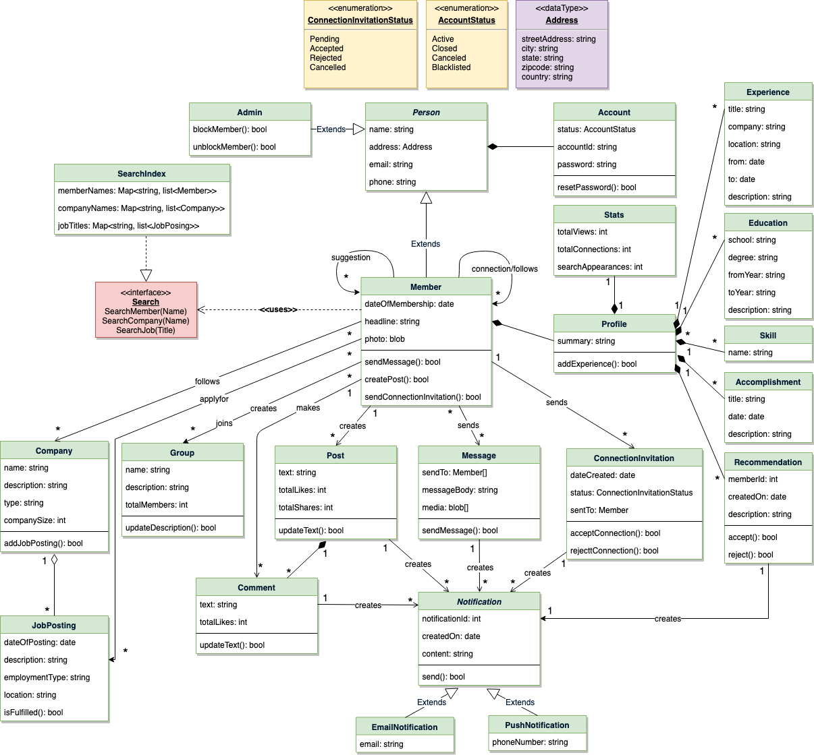

# Design LinkedIn
Let's design LinkedIn.

LinkedIn is a social network for professionals. The main goal of the site is to enable its members to connect with people they know and trust professionally, as well as to find new opportunities to grow their careers.

A LinkedIn member’s profile page, which emphasizes their skills, employment history, and education, has professional network news feeds with customizable modules.

LinkedIn is very similar to Facebook in terms of its layout and design. These features are more specialized because they cater to professionals, but in general, if you know how to use Facebook or any other similar social network, LinkedIn is somewhat comparable.

<p align="center">
  <br>
</p>

## System Requirements
We will focus on the following set of requirements while designing LinkedIn:
1. Each member should be able to add information about their basic profile, experiences, education, skills, and accomplishments.<br>

2. Any user of our system should be able to search for other members or companies by their name.<br>

3. Members should be able to send or accept connection requests from other members.<br>

4. Any member will be able to request a recommendation from other members.<br>

5. The system should be able to show basic stats about a profile, like the number of profile views, the total number of connections, and the total number of search appearances of the profile.<br>

6. Members should be able to create new posts to share with their connections.<br>

7. Members should be able to add comments to posts, as well as like or share a post or comment.<br>

8. Any member should be able to send messages to other members.<br>

9. The system should send a notification to a member whenever there is a new message, connection invitation or a comment on their post.<br>

10. Members will be able to create a page for a Company and add job postings.<br>

11. Members should be able to create groups and join any group they like.<br>

12. Members should be able to follow other members or companies.<br>

## Use case diagram
We have three main Actors in our system:
* **Member**: All members can search for other members, companies or jobs, as well as send requests for connection, create posts, etc.<br>
* **Admin**: Mainly responsible for admin functions such as blocking and unblocking a member, etc.<br>
* **System**: Mainly responsible for sending notifications for new messages, connections invites, etc.<br>

Here are the top use cases of our system:
* **Add update profile**: Any member should be able to create their profile to reflect their experiences, education, skills, and accomplishments.<br>
* **Search**: Members can search other members, companies or jobs. Members can send a connection request to other members.<br>
* **Follow or Unfollow member or company**: Any member can follow or unfollow any other member or a company.<br>
* **Send message**: Any member can send a message to any of their connections.<br>
* **Create post**: Any member can create a post to share with their connections, as well as like other posts or add comments to any post.<br>
* **Send notifications**: The system will be able to send notifications for new messages, connection invites, etc.<br>

<p align="center">
  <br>
  <i>Use case diagram</i>
</p>

## Class diagram
Here are the main classes of the LinkedIn system:
* **Member**: This will be the main component of our system. Each member will have a profile which includes their Experiences, Education, Skills, Accomplishments, and Recommendations. Members will be connected to other members and they can follow companies and members. Members will also have suggestions to make connections with other members.<br>

* **Search**: Our system will support searching for other members and companies by their names, and jobs by their titles.<br>

* **Message**: Members can send messages to other members with text and media.<br>

* **Post**: Members can create posts containing text and media.<br>

* **Comment**: Members can add comments to posts as well as like them.<br>

* **Group**: Members can create and join groups.<br>

* **Company**: Company will store all the information about a company’s page.<br>

* **JobPosting**: Companies can create a job posting. This class will handle all information about a job.<br>

* **Notification**: Will take care of sending notifications to members.<br>

<p align="center">
  <br>
  <i>Class diagram</i>
</p>

<p align="center">
  <br>
</p>

## Activity diagrams
* **Add experience to profile**: Any LinkedIn member can perform this activity. Here are the steps to add experience to a member profile:<br>
<p align="center">
  <br>
</p>

* **Send message**: Any Member can perform this activity. After sending a message, the system needs to send a notification to all the requested members. Here are the steps for sending a message:<br>
<p align="center">
  <br>
</p>

## Code
Here is the high-level definition for the classes described above:
* **Enums, data types, and constants**: Here are the required enums, data types, and constants:<br>
```
public enum ConnectionInvitationStatus {
  PENDING, ACCEPTED, CONFIRMED, REJECTED, CANCELED
}

public enum AccountStatus {
  ACTIVE, BLOCKED, BANNED, COMPROMISED, ARCHIVED, UNKNOWN
}

public class Address {
  private String streetAddress;
  private String city;
  private String state;
  private String zipCode;
  private String country;
}
```
* **Account, Person, Member, and Admin**: These classes represent the different people that interact with our system:<br>
```
// For simplicity, we are not defining getter and setter functions. The reader can
// assume that all class attributes are private and accessed through their respective
// public getter method and modified only through their public setter method.

public class Account {
  private String id;
  private String password;
  private AccountStatus status;

  public boolean resetPassword();
}

public abstract class Person {
  private String name;
  private Address address;
  private String email;
  private String phone;

  private Account account;
}

public class Member extends Person {
  private Date dateOfMembership;
  private String headline;
  private byte[] photo;
  private List<Member> memberSuggestions;
  private List<Member> memberFollows;
  private List<Member> memberConnections;
  private List<Company> companyFollows;
  private List<Group> groupFollows;
  private Profile profile;

  public boolean sendMessage(Message message);
  public boolean createPost(Post post);
  public boolean sendConnectionInvitation(ConnectionInvitation invitation);
}

public class Admin extends Person {
  public boolean blockUser(Customer customer);
  public boolean unblockUser(Customer customer);
}
```
* **Profile, Experience, etc**: A member’s profile will have their job experiences, educations, skills, etc:<br>
```
public class Profile {
  private String summary;
  private List<Experience> experiences;
  private List<Education> educations;
  private List<Skill> skills;
  private List<Accomplishment> accomplishments;
  private List<Recommendation> recommendations;
  private List<Stat> stats;

  public boolean addExperience(Experience experience);
  public boolean addEducation(Education education);
  public boolean addSkill(Skill skill);
  public boolean addAccomplishment(Accomplishment accomplishment);
  public boolean addRecommendation(Recommendation recommendation);
}

public class Experience {
  private String title;
  private String company;
  private String location;
  private Date from;
  private Date to;
  private String description;
}
```
* **Company and JobPosting**: Companies can have multiple job postings:<br>
```
public class Company {
  private String name;
  private String description;
  private String type;
  private int companySize;

  private List<JobPosting> activeJobPostings;
}

public class JobPosting {
  private Date dateOfPosting;
  private String description;
  private String employmentType;
  private String location;
  private boolean isFulfilled;
}
```
* **Group, Post, and Message**: Members can create posts, send messages, and join groups:<br>
```
public class Group {
  private String name;
  private String description;
  private int totalMembers;
  private List<Member> members;

  public boolean addMember(Member member);

  public boolean updateDescription(String description);
}

public class Post {
  private String text;
  private int totalLikes;
  private int totalShares;
  private Member owner;
}

public class Message {
  private Member[] sentTo;
  private String messageBody;
  private byte[] media;
}
```
* **Search interface and SearchIndex**: SearchIndex will implement the Search interface to facilitate searching for members, companies and job postings:<br>
```
public interface Search {
  public List<Member> searchMember(String name);

  public List<Company> searchCompany(String name);

  public List<JobPosting> searchJob(String title);
}

public class SearchIndex implements Search {
  HashMap<String, List<Member>> memberNames;
  HashMap<String, List<Company>> companyNames;
  HashMap<String, List<JobPosting>> jobTitles;

  public boolean addMember(Member member) {
    if (memberNames.containsKey(member.getName())) {
      memberNames.get(member.getName()).add(member);
    } else {
      memberNames.put(member.getName(), member);
    }
  }

  public boolean addCompany(Company company);

  public boolean addJobPosting(JobPosting jobPosting);

  public List<Member> searchMember(String name) {
    return memberNames.get(name);
  }

  public List<Company> searchCompany(String name) {
    return companyNames.get(name);
  }

  public List<JobPosting> searchJob(String title) {
    return jobTitles.get(title);
  }
}
```
