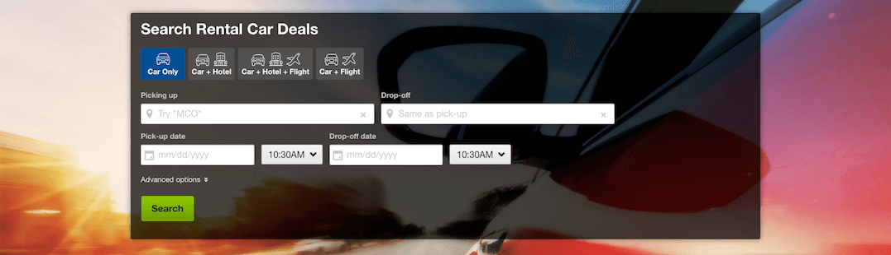
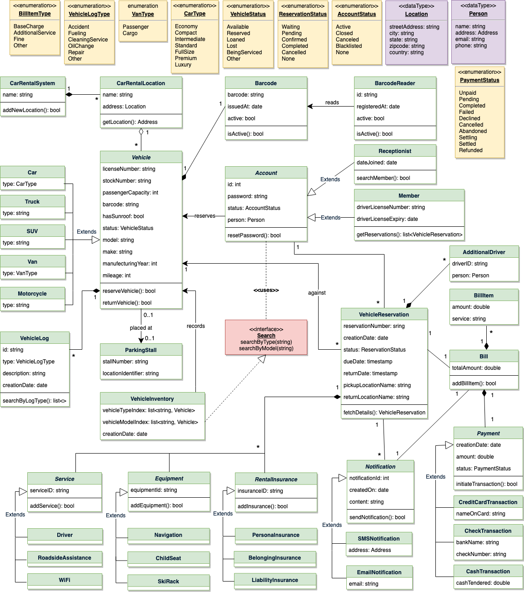

# Design a Car Rental System
Let's design a car rental system where customers can rent vehicles.

A Car Rental System is a software built to handle the renting of automobiles for a short period of time, generally ranging from a few hours to a few weeks. A car rental system often has numerous local branches (to allow its user to return a vehicle to a different location), and primarily located near airports or busy city areas.

<p align="center">
  <br>
</p>

## System Requirements
We will focus on the following set of requirements while designing our Car Rental System:
1. The system will support the renting of different automobiles like cars, trucks, SUVs, vans, and motorcycles.<br>

2. Each vehicle should be added with a unique barcode and other details, including a parking stall number which helps to locate the vehicle.<br>

3. The system should be able to retrieve information like which member took a particular vehicle or what vehicles have been rented out by a specific member.<br>

4. The system should collect a late-fee for vehicles returned after the due date.<br>

5. Members should be able to search the vehicle inventory and reserve any available vehicle.<br>

6. The system should be able to send notifications whenever the reservation is approaching the pick-up date, as well as when the vehicle is nearing the due date or has not been returned within the due date.<br>

7. The system will be able to read barcodes from vehicles.<br>

8. Members should be able to cancel their reservations.<br>

9. The system should maintain a vehicle log to track all events related to the vehicles.<br>

10. Members can add rental insurance to their reservation.<br>

11. Members can rent additional equipment, like navigation, child seat, ski rack, etc.<br>

12. Members can add additional services to their reservation, such as roadside assistance, additional driver, wifi, etc.<br>

## Use case diagram
We have four main Actors in our system:
* **Receptionist**: Mainly responsible for adding and modifying vehicles and workers. Receptionists can also reserve vehicles.<br>
* **Member**: All members can search the catalog, as well as reserve, pick-up, and return a vehicle.<br>
* **System**: Mainly responsible for sending notifications about overdue vehicles, canceled reservation, etc.<br>
* **Worker**: Mainly responsible for taking care of a returned vehicle and updating the vehicle log.<br>

Here are the top use cases of the Car Rental System:
* **Add/Remove/Edit vehicle**: To add, remove or modify a vehicle.<br>
* **Search catalog**: To search for vehicles by type and availability.<br>
* **Register new account/Cancel membership**: To add a new member or cancel an existing membership.<br>
* **Reserve vehicle**: To reserve a vehicle.<br>
* **Check-out vehicle**: To rent a vehicle.<br>
* **Return a vehicle**: To return a vehicle which was checked-out to a member.<br>
* **Add equipment**: To add an equipment to a reservation like navigation, child seat, etc.<br>
* **Update car log**: To add or update a car log entry, such as refueling, cleaning, damage, etc.<br>

<p align="center">
  <br>
  <i>Use case diagram</i>
</p>

## Class diagram
Here are the main classes of our Car Rental System:
* **CarRentalSystem**: The main part of the organization for which this software has been designed.<br>

* **CarRentalLocation**: The car rental system will have multiple locations, each location will have attributes like ‘Name’ to distinguish it from any other locations and ‘Address’ which defines the address of the rental location.<br>

* **Vehicle**: The basic building block of the system. Every vehicle will have a barcode, license plate number, passenger capacity, model, make, mileage, etc. Vehicles can be of multiple types, like car, truck, SUV, etc.<br>

* **Account**: Mainly, we will have two types of accounts in the system, one will be a general member and the other will be a receptionist. Another account can be of the worker taking care of the returned vehicle.<br>

* **VehicleReservation**: This class will be responsible for managing reservations for a vehicle.<br>

* **Notification**: Will take care of sending notifications to members.<br>

* **VehicleLog**: To keep track of all the events related to a vehicle.<br>

* **RentalInsurance**: Stores details about the various rental insurances that members can add to their reservation.<br>

* **Equipment**: Stores details about the various types of equipment that members can add to their reservation.<br>

* **Service**: Stores details about the various types of service that members can add to their reservation, such as additional drivers, roadside assistance, etc.<br>

* **Bill**: Contains different bill-items for every charge for the reservation.<br>

<p align="center">
  <br>
  <i>Class diagram</i>
</p>

<p align="center">
  <br>
</p>

## Activity diagrams
* **Pick up a vehicle**: Any member can perform this activity. Here are the steps to pick up a vehicle:<br>

<p align="center">
  <br>
</p>

* **Return a vehicle**: Any worker can perform this activity. While returning a vehicle, the system must collect a late fee from the member if the return date is after the due date. Here are the steps for returning a vehicle:<br>

<p align="center">
  <br>
</p>

## Code
Here is the high-level definition for the classes described above.
* **Enums, data types and constants**: Here are the required enums, data types, and constants:<br>
```
public enum BillItemType {
  BASE_CHARGE, ADDITIONAL_SERVICE, FINE, OTHER
}

public enum VehicleLogType {
  ACCIDENT, FUELING, CLEANING_SERVICE, OIL_CHANGE, REPAIR, OTHER
}

public enum VanType {
  PASSENGER, CARGO
}

public enum CarType {
  ECONOMY, COMPACT, INTERMEDIATE, STANDARD, FULL_SIZE, PREMIUM, LUXURY
}

public enum VehicleStatus {
  AVAILABLE, RESERVED, LOANED, LOST, BEING_SERVICED, OTHER
}

public enum ReservationStatus {
  ACTIVE, PENDING, CONFIRMED, COMPLETED, CANCELLED, NONE
}

public enum AccountStatus {
  ACTIVE, CLOSED, CANCELED, BLACKLISTED, BLOCKED
}

public enum PaymentStatus {
  UNPAID, PENDING, COMPLETED, FILLED, DECLINED, CANCELLED, ABANDONED, SETTLING, SETTLED, REFUNDED
}

public class Address {
  private String streetAddress;
  private String city;
  private String state;
  private String zipCode;
  private String country;
}

public class Person {
  private String name;
  private Address address;
  private String email;
  private String phone;
}
```
* **Account, Member, Receptionist, and Additional Driver**: These classes represent different people that interact with our system:<br>
```
// For simplicity, we are not defining getter and setter functions. The reader can
// assume that all class attributes are private and accessed through their respective
// public getter method and modified only through their public setter method.

public abstract class Account {
  private String id;
  private String password;
  private AccountStatus status;
  private Person person;

  public boolean resetPassword();
}

public class Member extends Account {
  private int totalVehiclesReserved;

  public List<VehicleReservation> getReservations();
}

public class Receptionist extends Account {
  private Date dateJoined;

  public List<Member> searchMember(String name);
}

public class AdditionalDriver {
  private String driverID;
  private Person person;
}
```
* **CarRentalSystem and CarRentalLocation**: These classes represent the top level classes:<br>
```
public class CarRentalLocation {
  private String name;
  private Address location;

  public Address getLocation();
}

public class CarRentalSystem {
  private String name;
  private List<CarRentalLocation> locations;

  public boolean addNewLocation(CarRentalLocation location);
}
```
* **Vehicle, VehicleLog, and VehicleReservation**: To encapsulate a vehicle, log, and reservation. The VehicleReservation class will be responsible for processing the reservation and return of a vehicle:<br>
```
public abstract class Vehicle {
  private String licenseNumber;
  private String stockNumber;
  private int passengerCapacity;
  private String barcode;
  private boolean hasSunroof;
  private VehicleStatus status;
  private String model;
  private String make;
  private int manufacturingYear;
  private int mileage;

  private List<VehicleLog> log;

  public boolean reserveVehicle();

  public boolean returnVehicle();
}

public class Car extends Vehicle {
  private CarType type;
}

public class Van extends Vehicle {
  private VanType type;
}

public class Truck extends Vehicle {
  private String type;
}

// We can have similar definition for other vehicle types

//...

public class VehicleLog {
  private String id;
  private VehicleLogType type;
  private String description;
  private Date creationDate;

  public bool update();

  public List<VehicleLogType> searchByLogType(VehicleLogType type);
}

public class VehicleReservation {
  private String reservationNumber;
  private Date creationDate;
  private ReservationStatus status;
  private Date dueDate;
  private Date returnDate;
  private String pickupLocationName;
  private String returnLocationName;

  private int customerID;
  private Vehicle vehicle;
  private Bill bill;
  private List<AdditionalDriver> additionalDrivers;
  private List<Notification> notifications;
  private List<RentalInsurance> insurances;
  private List<Equipment> equipments;
  private List<Service> services;

  public static VehicleReservation fectchReservationDetails(String reservationNumber);

  public List<Passenger> getAdditionalDrivers();
}
```
* **VehicleInventory and Search**: VehicleInventory will implement an interface ‘Search’ to facilitate the searching of vehicles:<br>
```
public interface Search {
  public List<Vehicle> searchByType(String type);
  public List<Vehicle> searchByModel(String model);
}

public class VehicleInventory implements Search {
  private HashMap<String, List<Vehicle>> vehicleTypes;
  private HashMap<String, List<Vehicle>> vehicleModels;

  public List<Vehicle> searchByType(String query) {
    // return all vehicles of the given type.
    return vehicleTypes.get(query);
  }

  public List<Vehicle> searchByModel(String query) {
    // return all vehicles of the given model.
    return vehicleModels.get(query);
  }
}
```
